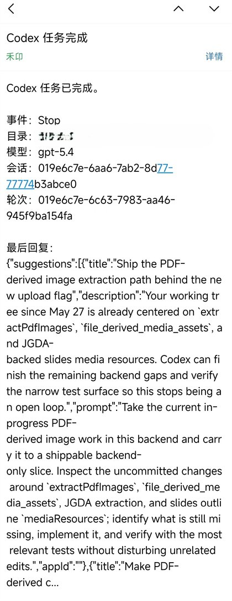
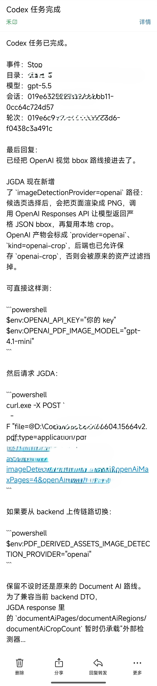

# CodexHookNotify

Windows-first email notifications for Codex Desktop `Stop` hooks.

CodexHookNotify is a tiny Go executable that reads Codex hook JSON from stdin, formats the final assistant reply, and sends it to your mailbox through SMTP. It is designed for people who let Codex work in the background and want a phone notification when a turn finishes.

<p align="center">
  
  
</p>

## Features

- Native Codex Desktop `Stop` hook integration through `~/.codex/hooks.json`.
- Single Windows executable: no Python, Node.js, or background daemon required at runtime.
- SMTP support for QQ Mail and other providers that support STARTTLS or implicit TLS.
- Chinese-friendly email subject/body encoding.
- Optional session-title lookup from Codex Desktop's local `session_index.jsonl`.
- Optional Markdown attachment with the full assistant reply when the email preview is truncated.
- Manual UTF-8 test modes that avoid PowerShell pipe encoding issues.
- Deduplication window to avoid repeated emails from rapid hook retries.
- Local log file for troubleshooting.
- AI-installable repository instructions in `AGENTS.md`.
- Experimental Codex plugin/marketplace scaffold under `plugins/`.

## How It Works

```text
Codex Desktop turn finishes
  -> Stop hook receives JSON on stdin
  -> notify-mail.exe reads notify-mail.yaml
  -> SMTP sends an email
  -> your phone mail app receives the notification
```

## Quick Install

Run from a local checkout on Windows:

```powershell
cd D:\Code\CodexHookNotify
.\scripts\install.ps1
```

The installer will:

- build `notify-mail.exe` into `%USERPROFILE%\.codex\hooks`;
- copy `notify-mail.yaml.example` to `%USERPROFILE%\.codex\hooks\notify-mail.yaml` if it does not exist;
- create or update `%USERPROFILE%\.codex\hooks.json`;
- back up an existing `hooks.json` before writing.

Then edit the SMTP config:

```powershell
notepad $env:USERPROFILE\.codex\hooks\notify-mail.yaml
```

For QQ Mail, enable SMTP in mailbox settings and use the SMTP authorization code as `password`; do not use your QQ login password.

Finally, fully quit and restart Codex Desktop, then trust the Stop hook in the Hooks page.

## Manual Build

```powershell
.\build.ps1
```

This builds:

```text
%USERPROFILE%\.codex\hooks\notify-mail.exe
```

## Manual Test

Use `--test-json` or `--test-json-file` instead of piping JSON through PowerShell. This keeps Chinese text intact on Chinese Windows systems.

```powershell
$exe = "$env:USERPROFILE\.codex\hooks\notify-mail.exe"
$cfg = "$env:USERPROFILE\.codex\hooks\notify-mail.yaml"

& $exe --config $cfg --test-json '{"cwd":"D:\\Code\\Test","model":"gpt-5.5","last_assistant_message":"手动测试邮件"}'
```

Dry-run without sending email:

```powershell
& $exe --config $cfg --dry-run --test-json '{"cwd":"D:\\Code\\Test","model":"gpt-5.5","last_assistant_message":"手动测试邮件"}'
```

Read logs with UTF-8:

```powershell
Get-Content "$env:USERPROFILE\.codex\hooks\notify-mail.log" -Tail 20 -Encoding UTF8
```

## Session Titles

Codex Desktop keeps a local session title index at:

```text
%USERPROFILE%\.codex\session_index.jsonl
```

CodexHookNotify maps the hook `session_id` to the local `thread_name` and includes it in the email body:

```yaml
session:
  titleLookup: true
  indexPath: ""
  maxTitleLength: 80
```

Leave `indexPath` empty to use the default Codex Desktop path. If the file is missing or no title matches the current session id, the email still sends normally with the raw session id.

## Markdown Attachments

CodexHookNotify keeps the email body short for quick mobile reading. When the assistant reply is truncated by `mail.maxMessageLength`, it can attach the full reply as Markdown:

```yaml
attachment:
  enabled: true
  mode: when_truncated
  filenamePrefix: codex-reply
  maxBytes: 2097152
```

Modes:

- `when_truncated`: attach Markdown only when the email preview is truncated.
- `always`: attach Markdown for every non-empty assistant reply.
- `never`: disable Markdown attachments.

The attachment uses `text/markdown` and keeps the original assistant Markdown. `maxBytes` prevents unusually large replies from creating oversized emails; if the generated attachment exceeds the limit, the attachment is truncated with a note.

## AI-Assisted Install

This repository includes `AGENTS.md` for Codex and other coding agents. A user can give the repository URL to Codex and ask it to install CodexHookNotify. The agent should run the installer, verify local files, and remind the user to fill in the SMTP authorization code manually.

The AI instructions deliberately forbid printing or collecting SMTP passwords in chat.

## Experimental Plugin Scaffold

The `plugins/codex-hook-notify` directory is an early Codex plugin wrapper. For now it provides a skill that teaches Codex how to install and maintain the hook safely. The actual hook still writes to the user's normal `~/.codex/hooks.json`, because Codex requires users to review and trust hooks explicitly.

See `docs/PLUGIN.md` for the packaging plan.

## Security

- Never commit `notify-mail.yaml`; it contains SMTP credentials.
- Prefer provider-specific SMTP authorization codes over account passwords.
- Codex hooks should be reviewed and trusted in Codex Desktop before running.
- The executable logs delivery status, not SMTP passwords.

## Troubleshooting

See `docs/TROUBLESHOOTING.md`.

## License

MIT
